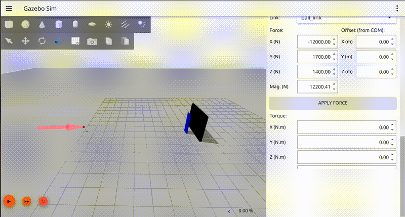

# RoboKeeper — Stereo Vision-Based Ball Trajectory Prediction System

A real-time stereo vision and physics-based ball trajectory prediction system developed in **C++** for the **RoboKeeper** platform. The project estimates the 3D position of a soccer ball using stereo cameras, predicts its future trajectory using kinematic equations, and controls a robotic goalkeeper within a ROS & Gazebo simulation.

---

## Demo

### RoboKeeper Prediction

  

The prediction results shown in the demo are available in **[positions.txt](assets/positions.txt)**, which contains the estimated 3D ball positions generated during the simulation.

The prediction results shown in the demo are available in **[positions.txt](assets/positions.txt)**, which contains the estimated 3D ball positions generated during the simulation.

> **Note:** During the first few frames, predictions may be unstable because the stereo vision system has not yet accumulated sufficient measurements for a reliable state estimate. As new observations are incorporated, the predictions converge and stabilize. Invalid predictions are ignored by the goalkeeper controller and are not used for decision-making.

---

## Features

* Real-time stereo vision-based 3D ball localization
* Physics-based trajectory prediction
* Kinematic motion modeling
* Robotic goalkeeper angle estimation
* ROS 2 integration
* Gazebo simulation environment
* High-frequency stereo camera pipeline (240 Hz)

---

## System Overview

The perception pipeline consists of two synchronized stereo cameras operating at **240 Hz**. The system reconstructs the ball's 3D position from stereo observations and continuously estimates its velocity.

The reconstructed 3D ball positions are refined using a Kalman filter to reduce measurement noise, providing more stable position estimates for trajectory prediction.

Using classical kinematic equations, the future trajectory of the ball is predicted in real time. The predicted interception point is then converted into a goalkeeper rotation command that is published through ROS topics and executed inside Gazebo.

---

## Camera Update Rate

Many RoboKeeper systems and related studies employ camera or sensor update rates approaching **1000 Hz** to achieve highly accurate ball interception.

In this project, the complete stereo vision and trajectory prediction pipeline operates using only **240 Hz** synchronized stereo cameras while maintaining successful real-time ball tracking and trajectory prediction. This demonstrates that reliable goalkeeper prediction can be achieved with significantly lower sensing frequencies and reduced hardware requirements.

---

## Physics Simulation

The simulation was designed to closely resemble real-world soccer conditions.

* Standard FIFA soccer ball mass (**0.43 kg**)
* Physics engine with collision handling
* Gravity
* Contact dynamics
* Friction
* Ball inertia
* Realistic projectile motion

Rather than relying on purely data-driven prediction, the system combines stereo vision measurements with analytical physics models for trajectory estimation.

---

## Test Configuration

| Parameter              |        Value |
| ---------------------- | -----------: |
| Ball Mass              |      0.43 kg |
| Camera Update Rate     |       240 Hz |
| Physics Step Size      |         1 ms |
| Applied Force          |   **12200.41 N** |
| Approximate Ball Speed | **102.1 km/h** |

---

## Technologies

* C++
* ROS 2 (Jazzy)
* Gazebo
* OpenCV
* Eigen
* Computer Vision
* Stereo Vision
* Kalman Filter
* Kinematic Modeling
* Physics-Based Prediction

---

## Project Status

* ✅ Stereo vision system completed
* ✅ Physics-based prediction completed
* ✅ Gazebo integration completed
* ✅ Goalkeeper control completed
* 🚧 Continuous development of the simulation model, including improved trajectory prediction, enhanced physics realism, and controller optimization.
* ⏳ Physical hardware deployment planned following mechanical subsystem integration.

---

## Disclaimer

This repository is intended to showcase the project's objectives, methodology, and demonstration results. Certain implementation details, source code, algorithms, and supporting resources have been intentionally omitted and are not publicly available.

